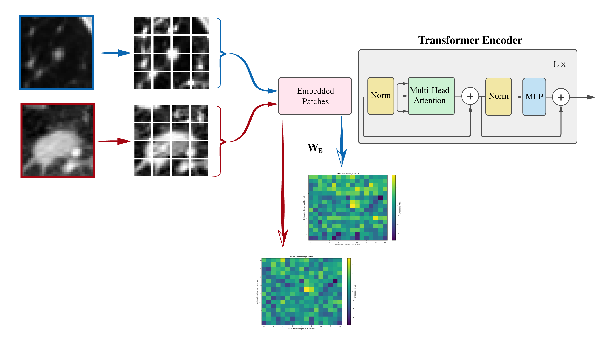
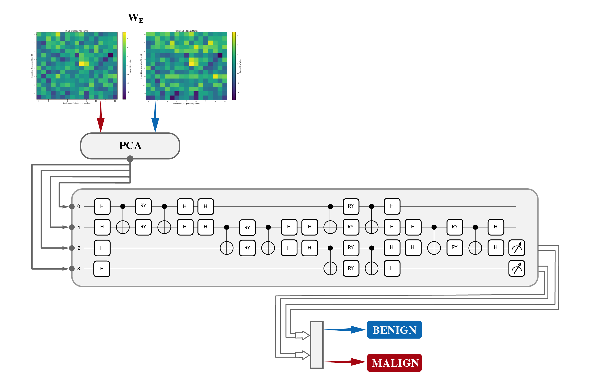
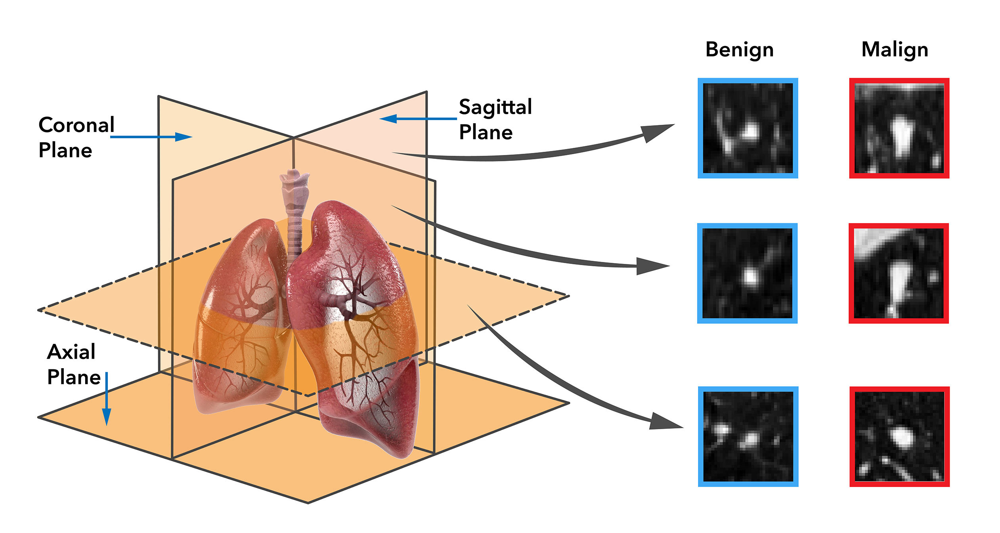

# Vision Transformer Embeddings and Quantum Pyramidal Circuits for Biomedical Image Analysis

This work presents a novel quantum-hybrid pipeline for lung nodule classification in computed tomography (CT) scans, combining Vision Transformer (ViT) embeddings with quantum orthogonal neural networks 

---

# Contents of the work

## Authors
- Xavi F. Aragones¹²
- Miguel A. González Ballester¹³⁴

### Affiliations
1. BCN Medtech, Dept. of Engineering, Universitat Pompeu Fabra, Barcelona, Spain
2. Parc Tecnològic TecnoCampus Mataró-Maresme - UPF, Spain
3. Quantic, Barcelona Supercomputing Center, Barcelona, Spain
4. ICREA, Barcelona, Spain

## Introduction
We present a novel quantum–hybrid algorithm that combines trained Vision Transformers (ViT) with orthogonal quantum-inspired models to classify lung nodules from CT.  
We address two key constraints of medical imaging, limited data and compute by learning ViT embeddings and classifying in through a low-dimensional subspace.  
Our approach preserves diagnostic performance while dramatically reducing parameters and training time.  
Results are reported plane-wise (axial, coronal, sagittal).

## Methods
We train a lightweight ViT to obtain fixed **embeddings** from patches; embeddings are **projected with PCA** to k∈{2,4,8,16}.  
A quantum pipeline is applied through **orthogonal pyramidal network** (RBS rotations) that finished with a binary classification (benign vs. malignant).  
This design is quantum-inspired (unitary-like, norm-preserving) yet runs on classical hardware.  

  
*ViT splits CT slices into patches and yields embedding heatmaps used as fixed features.*

  
*ViT embeddings → PCA (k=2/4/8/16) → orthogonal pyramidal RBS circuit → softmax classifier.*

## Experimental Setup
Dataset: LIDC-IDRI; 681 curated nodules, central 32×32 slices per plane (axial, sagittal, coronal).  
Stratified splits: train 481, val 100, test 100; 10 repetitions per configuration.  
Two baselines: ViT₁ (1 head, 4 layers) and ViT₂ (4 heads, 8 layers).  
Training uses AdamW (lr 3e-4, ε=1e-8, weight decay 0.01).

  
*Orthogonal planes with benign (blue) and malignant (red) exemplars.*

## Results
Hybrid models match classical means with **orders-of-magnitude fewer parameters** (e.g., 10,290→7; ~99.96% reduction).  
Training is **18–28× faster** while preserving accuracy; typical ROC–AUC **0.88–0.90**, maxima up to **0.97** (coronal).  
ViT₂ improves the classical baseline; hybrid configs like (k=8,h=8) or (k=16,h=8) are strong trade-offs.  
All metrics are reported per plane to expose variability and stability across views.

  
  
  

## Discussion
The quantum-hybrid pipeline preserves diagnostic performance while drastically reducing model size and computational time.  
Orthogonal RBS layers act as strong geometric regularizers, yielding stable training and consistent plane-wise results.  

